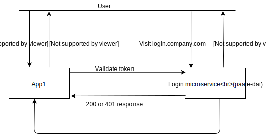

paale-dai
=======================
[![NPM Version][npm-image]][npm-url]
[![NPM Downloads][downloads-image]][downloads-url]
[![Build Status][travis-image]][travis-url]
[![Test Coverage][coveralls-image]][coveralls-url]

paale-dai is an express based middleware for creating SSO based authentication microservice.

## Example usage with google oauth2 authentication and JWT
```js
const paale = require('paale-dai');
const handler = require('paale-dai/handler/google-oauth2');
const jwtStorage = require('paale-dai/storage/jwt');


const server = paale(
  handler('GOOGLE_CLIENT_ID', 'GOOGLE_CLIENT_SECRET'),
  jwtStorage(),
);

server.listen();

// using paale-dai as a middleware
// or express().use('/paale', server); 
```

## Install

This is a [Node.js](https://nodejs.org/en/) module available through the
[npm registry](https://www.npmjs.com/). Installation is done using the
[`npm install` command](https://docs.npmjs.com/getting-started/installing-npm-packages-locally):


```
$ npm install paale-dai
```

## Demo
A demo can be found at [paale-dai.herokuapp.com/?service=http://app1.mycompany.com](paale-dai.herokuapp.com/?service=http://app1.mycompany.com)

## Basic concept


## Handler
Handler is the object which actually handles the authentication. Currently, this modules only ships with `google-oauth2` handler which does authentication based on google oauth2. Similarly you can rewrite your own handler like based on facebook oauth2 flow.
 
### Example handler based on username/password
```js
const handler = {
   landing(callbackPath) {
     return (req, res, next) => {
       // render login page here
     };
   },
   authentication(callbackPath) {
     return (req, res, next) => {
       if (user = validateUser(req.body.username, req.body.password)) {
         req.paale_user = user;
         next();
       }
       
       // incorrect authentication attempt
     };
   },   
   parseService(req) {
     return req.query.service;
   }
};
``` 


## Using cookies
You can enable cookie support using package [cookies](cookie-package) if you don't want the handler to do authentication every time login request is made by the user.

```js
const express = require('express'); 
const Cookies = require('cookies');

const app = express();
app.use(Cookies.express());

paale(
  handler(),
  jwtStorage(),
  {
    useCookie: true,
    app
  }
);
```

## API
```
paale(
      handler,
      tokenStorage,
      {
        identityPath = '/user',
        landingPath = '/',
        callbackPath = '/authentication',
        callbackRouteMethod = 'get',
        serviceValidator = () => true,
        useCookie = false,
        cookieOptions = {},
        app = express(),
      } = {}
)
```

## Validating token
In the above figure, after the application has received the token, it can make query to `paale-dai` to validate the token using cookie `paale_token=token` or header `Authorization: Bearer token`


## Token storage
Token storage are a way to store the tokens. They map a token to a user. You can store the tokens in a database by creating a custom token storage. 
By default this package ships with only JWT based token storage. If you use it, the applications can validate the token themselves without querying the `paale-dai` all the time if they have the public key.

[npm-image]: https://img.shields.io/npm/v/paale-dai.svg
[npm-url]: https://npmjs.org/package/paale-dai
[coveralls-image]: https://coveralls.io/repos/github/IntroCept/paale-dai/badge.svg?branch=master
[coveralls-url]: https://coveralls.io/github/IntroCept/paale-dai?branch=master
[downloads-image]: https://img.shields.io/npm/dm/paale-dai.svg
[downloads-url]: https://npmjs.org/package/paale-dai
[travis-image]: https://travis-ci.org/IntroCept/paale-dai.svg?branch=master
[travis-url]: https://travis-ci.org/IntroCept/paale-dai
[cookie-package]: https://npmjs.org/package/cookies

